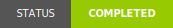

# The Slimy Swamp

> Information about [The Slimy Swamp](https://github.com/TheSlimySwamp)!

## License

  &copy; 2024-2025 <a rel="cc:attributionURL dct:creator" property="cc:attributionName" href="https://esoteric.foundation">Esoteric Foundation</a>

  <a property="dct:title" rel="cc:attributionURL" href="/">The Slimy Swamp .github</a> is licensed under <a href="../LICENSE" target="_blank" rel="license noopener noreferrer" style="display: inline-block">CC BY-SA 4.0</a>.

  

## Topics

[readme](https://github.com/topics/readme), [profile](https://github.com/topics/profile), [organization](https://github.com/topics/organization), [organisation](https://github.com/topics/organisation), [profiles](https://github.com/topics/profiles), [organizations](https://github.com/topics/organizations), [readme-md](https://github.com/topics/readme-md), [profile-readme](https://github.com/topics/profile-readme), [readme-profile](https://github.com/topics/readme-profile), [readme-organization](https://github.com/topics/readme-organization), [organization-readme](https://github.com/topics/organization-readme), [organization-profile](https://github.com/topics/organization-profile), [org-readme](https://github.com/topics/org-readme)
